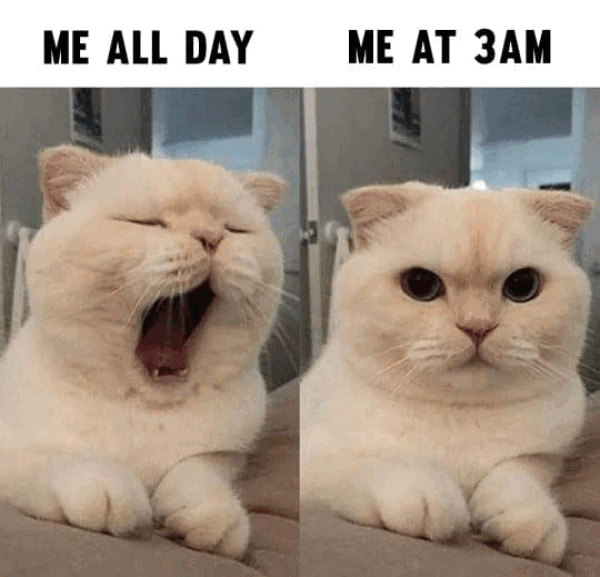

```{r setup, include=FALSE}
knitr::opts_chunk$set(echo=TRUE, message=FALSE, warning=FALSE, error=FALSE)
library(magick)
```

```{css}
h1{
  color: #DFEBEB;
  font-weight: bold;
}
h2 {
  color: #000000;
  padding: 15px;
  text-align: center;
  background-color: #B5D0E0;
  border-radius: 25px;
}
h3{
  color: #B8B4BE;
}
h4{
  color: #F4E9F3;
}
body {
  font-size: 12pt;
  font-family: Overpass;
  background-color: #000000;
  color: #EDE8D5;
}

```

## Project requirements
I've successfully met the Github requirements by setting up my GitHub account and created a new respiratory called "STATS220". I've ensure that the README.md file has demonstrated all the required markdown syntax as listed in the project requirements.

I've completed the tasks as listed in the projects list and created both the my_meme.png and also the my_animation.gif files using meme.R. I've created my meme not only based on cats and course materials but also my unique perspective on small habits in life. This meme project not only shows the technical R markdown skills I've learnt in lectures but also sharing glimpse of me. 

Click here to view my [STATS220](https://github.com/belleyong/STATS220) project page!


## My meme
<h4>Inspo meme:</h4>


I've used my inspiration meme as an inspiration to guide me to create a meme of my own. I've kept the composition of the cat pictures and changed the text on the top and added text on the bottom. I've also used other cat images that shows different emotions and correspond to the bits of text I've added.

```{r meme-code, eval=TRUE}
library(magick)
# my meme frame 1 
hungry_text <- image_blank(width = 300, height = 100, color = "#FFFFFF") %>% 
  image_annotate(text = "Me  WHEN  I'M  HUNGRY", color = "#000000", size = 30, font = "IMPACT", gravity = "center")

food_text <- image_blank(width = 300, height = 100, color = "#FFFFFF") %>% 
  image_annotate(text = "ME  WHEN I  HAVE  FOOD", color = "#000000", size = 30, font = "IMPACT", gravity = "center")

# read/get the image and change the size of the image
crying_cat <- image_read("https://i.pinimg.com/736x/9d/70/b8/9d70b860a93cc01702926970874cdcf2.jpg") %>% 
  image_scale(305)

happy_star_cat <- image_read("https://preview.redd.it/cute-cats-3-i-have-no-clue-what-to-post-so-yeah-and-you-can-v0-kwevwk6tpzba1.jpg?width=640&crop=smart&auto=webp&s=51b27e2a51f087d7d56a6efcc5ceef4b0e34208e") %>% 
  image_scale(300)

# make introduction text 
introduction <- image_blank(width = 600, height = 90, color = "#FFFFFF") %>%
  image_annotate(text = "A LITTLE ABOUT ME", color = "#000000", font = "IMPACT", size = 35, gravity = "center")

# combine text for top row 
words <- c(hungry_text, food_text)
words_row <- image_append(words)

#combine pictures for bottom row 
cats <- c(crying_cat, happy_star_cat)
cats_row <- image_append(cats) #append

# create a vector by combining all the text and image
my_meme <- c(words_row, cats_row, introduction) %>% 
  image_append(stack = TRUE)

# create my_meme.png
image_write(my_meme, "my_meme.png")

my_meme

```


```{r animation-code, eval=FALSE}
library(magick)

# inspiration meme link : https://www.care.com/c/getting-older-memes/

# store url 
meme_url <- "https://www.care.com/c/wp-content/uploads/sites/2/2021/04/maressab-202115020615567399.jpg.optimal.jpg"

meme <- image_read(meme_url) %>% 
  image_scale(600)

image_write(meme, "inspo_meme.png")

# static memes creation (5 Frames)
# my meme frame 1 
hungry_text <- image_blank(width = 300, height = 100, color = "#FFFFFF") %>% 
  image_annotate(text = "Me  WHEN  I'M  HUNGRY", color = "#000000", size = 30, font = "IMPACT", gravity = "center")

food_text <- image_blank(width = 300, height = 100, color = "#FFFFFF") %>% 
  image_annotate(text = "ME  WHEN I  HAVE  FOOD", color = "#000000", size = 30, font = "IMPACT", gravity = "center")

# read/get the image and change the size of the image
crying_cat <- image_read("https://i.pinimg.com/736x/9d/70/b8/9d70b860a93cc01702926970874cdcf2.jpg") %>% 
  image_scale(305)

happy_star_cat <- image_read("https://preview.redd.it/cute-cats-3-i-have-no-clue-what-to-post-so-yeah-and-you-can-v0-kwevwk6tpzba1.jpg?width=640&crop=smart&auto=webp&s=51b27e2a51f087d7d56a6efcc5ceef4b0e34208e") %>% 
  image_scale(300)

# make introduction text 
introduction <- image_blank(width = 600, height = 90, color = "#FFFFFF") %>%
  image_annotate(text = "A LITTLE ABOUT ME", color = "#000000", font = "IMPACT", size = 35, gravity = "center")

# combine text for top row 
words <- c(hungry_text, food_text)
words_row <- image_append(words)

#combine pictures for bottom row 
cats <- c(crying_cat, happy_star_cat)
cats_row <- image_append(cats) #append

# create a vector by combining all the text and image
my_meme <- c(words_row, cats_row, introduction) %>% 
  image_append(stack = TRUE)

# create my_meme.png
image_write(my_meme, "my_meme.png")

# my meme frame 2 

sad_cat <- image_read("https://pbs.twimg.com/profile_images/1070028306790141952/P3tkvBDi_400x400.jpg") %>% 
  image_scale(255)
    
happy_cat <- image_read("https://encrypted-tbn0.gstatic.com/images?q=tbn:ANd9GcS_HITWQZZ5zgTHFM3PSvUjzqwls1LiYiOzwcQXalM69w&s") %>% 
  image_scale(255)
    
rain_text <- image_blank(width = 300, height = 200, color = "#FFFFFF") %>%
  image_annotate(text = "Me when it RAINS", color = "#000000", size = 35, font = "IMPACT", gravity = "center")

sunny_text <- image_blank(width = 300, height = 200, color = "#FFFFFF") %>%
  image_annotate(text = "Me when it's SUNNY", color = "#000000", size = 35, font = "IMPACT", gravity = "center")

introduction <- image_blank(width = 600, height = 50, color = "#FFFFFF") %>%
  image_annotate(text = "A LITTLE ABOUT ME", color = "#000000", font = "IMPACT", size = 35, gravity = "center")

# combine text and picture for top row 
top_row <- image_append(c(rain_text, sad_cat))

# combine text and picture for bottom row 
bottom_row <- image_append(c(sunny_text, happy_cat))

my_meme2 <- c(introduction, top_row, bottom_row) %>%
  image_append(stack = TRUE)

# my meme frame 3 
stats_text <- image_blank(width = 600, height = 100, color = "#FFFFFF") %>%
  image_annotate(text = "ME WHEN SOMEONE STARTS TALKING\nABOUT STATS 220", color = "#000000", size = 25, font = "IMPACT", gravity = "north")

stats_cat <- image_read("https://m.media-amazon.com/images/I/51ZjBEW+qNL._AC_UF894,1000_QL80_.jpg") %>%
  image_scale(600)

introduction <- image_blank(width = 600, height = 50, color = "#FFFFFF") %>%
  image_annotate(text = "A LITTLE ABOUT ME", color = "#000000", font = "IMPACT", size = 35, gravity = "center")

my_meme3 <- c(introduction, stats_cat, stats_text) %>%
  image_append(stack = TRUE)

# my meme frame 4 
confused_cat <- image_read("https://i.pinimg.com/564x/33/29/04/332904f53cd846c45fcf0f2ce682272d.jpg") %>%
  image_scale(450)

cereal_text <- image_blank(width = 450, height = 35, color = "#000000") %>%
  image_annotate(text = "ME WHEN SOMEONE PUTS MILK BEFORE CEREAL", color = "#FF0000", size = 20, font = "IMPACT", gravity = "center")

introduction <- image_blank(width = 450, height = 35, color = "#000000") %>%
  image_annotate(text = "A LITTLE ABOUT ME", color = "#FFFFFF", font = "IMPACT", size = 20, gravity = "center")

my_meme4 <- c(introduction, confused_cat, cereal_text) %>%
  image_append(stack = TRUE)

# my meme frame 5 
# create the top meme text 
money_emoji <- image_blank(width = 600, height = 100, color = "#FFFFFF") %>%
  image_annotate(text = "A LITTLE ABOUT ME ^$_$^", color = "#000000", font = "IMPACT", size = 20, gravity = "center")
# read the cat image 
money_cat <- image_read("https://thinksaveretire.com/wp-content/uploads/2019/01/money-memes-12.jpg") %>% 
  image_scale(600)
# create the bottom meme text 
money_text <- image_blank(width = 600, height = 100, color = "#FFFFFF") %>%
  image_annotate(text = "ME WITH MY DREAMS", color = "#000000", font = "IMPACT", size = 25, gravity = "center")
# create a vector that combines all text and image
my_meme5 <- c(money_emoji, money_cat, money_text) %>%
  image_append(stack = TRUE )

# combine all 4 frames together 
combined_meme <- c(meme, my_meme, my_meme2, my_meme3, my_meme4, my_meme5)

# animation
animated_gif <- combined_meme %>% 
  image_animate(fps = 0.5)

# create my_animation gif 
image_write(animated_gif, "my_animation.gif")
```

`

## Creativity
I've changed the appearance of my HTML by using CSS. I've changed all the colors of the headers and made the background color of my HTML black. I've also incorporated italics and bolding to my headings. I've used padding to all my h2 headings so my HTML would look neater. I've also changed the font and font size of many headings and text.

I've also ensured that all my memes' frames are different. I also made sure that I've used a wide variety of cat pictures and alternated the position of them in the meme. I've also used a different type of font compared to the inspiration meme and used different colors of fonts and backgrounds. I've scale the images to fit and made sure they are aligned to each other. I've also experiment with diverse layouts such as stacking images and text differently for each frame so some frame has the picture and text next to each other while some has the picture under the text. 

## Learning reflection
I've learnt how to use the magick library to perform image processing/editing and to render images/gifs. I found this very fun and challenging to use this magick library as the R language is still rather new to the world and there is less help/examples compared to other more "used" languages. I still found the documentation for the library very useful and this project very fun to do. I also learnt how GitHub works and how to upload files onto GitHub which is very useful for version controlling. The little bit of CSS and markdown was also very interesting. 

I'm more curious on the technology that the magick library uses. How does it work? and how does it grab image data and change it? What procedures does the package do on the image that changes it. 