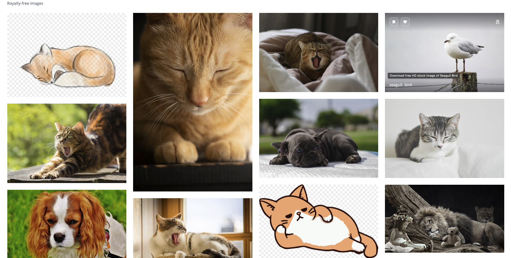
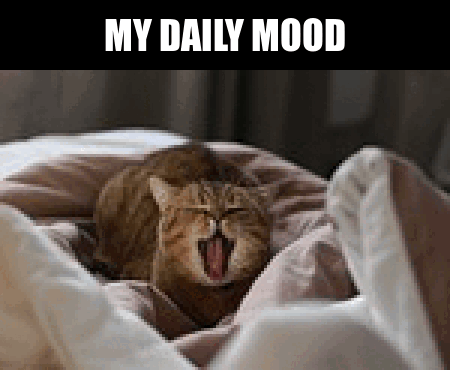

```{r setup, include=FALSE}
library(tidyverse)
photo_data <- read_csv("selected_photos.csv")

knitr::opts_chunk$set(echo=TRUE, message=FALSE, warning=FALSE, error=FALSE)
```

```{css echo=FALSE}
h1 {
  font-weight: bold;
  color: #263238
  text-align: center;
}
h2 {
  color: #99a8c5;
  padding: 15px;
  text-align: center;
  border-radius: 10px;
  margin-top: 20px;
  margin-bottom: 20px;
  border: 1px solid #000000;
  padding-bottom: 5px;
}
h3 {
  color: #3E4551;
  font-style: Overpass;
  margin-top: 10px;
  margin-bottom: 10px;
}
body {
  font-size: 12pt;
  font-family: Italic;
  background-color: #f0f0f0;
  color: #000000;
  line-height: 1.6;
}
img {
  max_width: 100%;
}

```

## Introduction 

I’ve chosen the words ‘**sleepy animal**’ as the words to search for photos on pixabay.com. Animals are really adorable when they are tired and the sleepiness aspect relates to me the most. These cute animals are also heartwarming to look at!



Different features noticed:

1. I noticed that the photos returned by the words ‘sleepy animal’ on Pixabay are mostly taken in landscape position and are mostly animals like cats and dogs. 
2. Based on the trends observed, the pictures often have more than 5000 views and around 50 likes or more. 
3. The photos tend to be tagged with words like yawn, tired, pets. The photos often have a neutral tone of colours with soft and warm lighting to emphasise the cozy atmosphere around the sleepy animals. 

```{r}
photo_data %>%
  select(pageURL) %>%
  knitr::kable()
```



## Key features of selected photos

### What is the median number of views for these images?
```{r}
median_views <- photo_data$views %>% median(na.rm = TRUE)
```
These images have a median number of views of `r median_views`.

### What is the total amount of likes for these images? 
```{r}
# total likes 
total_likes <- photo_data$likes %>% sum()
```
These images received a total of `r total_likes` likes.

### What is the median number of downloads for these images? 
```{r}
# total downloads 
median_downloads <- photo_data$downloads %>% median(na.rm = TRUE) %>% round()
```
The median number of downloads for these images are `r median_downloads`.

### What is the mean number of comments for these images? 
```{r}
# total downloads 
mean_comments <- photo_data$comments %>% mean(na.rm = TRUE) %>% round()
```
These images have a mean of `r mean_comments` comments. 

## Creativity
```{r}
photo_data %>%
  ggplot() +
  geom_bar(aes(x = popularity, fill = image_filter)) + 
  labs(title = "Does a sleepy dog image have a higher popularity?", # The plot has a title so conveys the purpose of the plot clearer
       x = "Popularity", # name x-axis as Popularity 
       y = "Number of Images") # name y-axis as Number of Image
```

I have combined ideas and skills learnt from the previous projects with this project.  

I created a vertical bar chart using `ggplot()` that was taught in previous labs. I created the plot by using the variable `popularity` from my data frame and used the `image_filter` variable to fill the bars. The bar plot clearly conveys my purpose of differentiating and displaying the difference of "sleepy dog images" and if they have higher popularity than other sleep animals. The clear title at the top and also colour difference shows us that sleepy dog pictures have a lower ratio in both `less popular` and `more popular` images compared to any other sleepy animals. 

I also used CSS styling that I learned during the previous labs and projects to design my HTML and to make it look nicer. 

## Learning Reflection 

One important idea i’ve learnt from "Module 3 Creating new variables and data tables", is interacting with the jsonlite package in R. I've learnt to read data from JSON files and turn them into a data frame alongside with using functions like `mutate()` and `ifelse()` to create new variables that have conditional statements that leads to different outputs based on different conditions. It is amazing how R is able to work with JSON data flexibility allowing us to analyse and create new sets of data from the JSON data effectively. 

I'm curious to explore image processing and image recognition further. I'm interested in how technology can process images and how it interprets images. By exploring these areas further I'm hoping to understand data technologies more and have to ability to use them in the future for creating data plots to analyse photos with, and maybe image recognition to automate data collection from large databases such as pixabay.com.

## Appendix 
```{r file='exploration.R', eval=FALSE, echo=TRUE}

```
