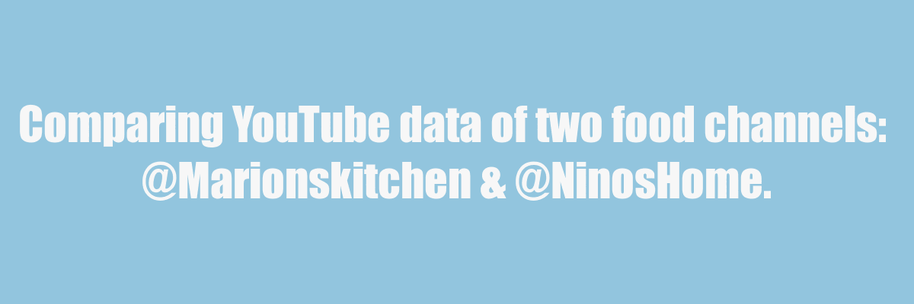

```{r setup, include=FALSE}
knitr::opts_chunk$set(echo=TRUE, message=FALSE, warning=FALSE, error=FALSE)
```

```{css echo=FALSE}
@import url('https://fonts.googleapis.com/css?family=Inconsolata|Londrina+Solid&display=swap');

.subtitle {
  color: #f4a582;
  font-family: 'Londrina Solid';
  font-weight: 100;
  box-sizing: border-box;
  background-color: #F0F0F0;
  padding: 10px;
  border: #F0F0F0 solid 1px;
  border-radius: 10px;
  font-style: italic;
  margin-bottom: 10px;
  display: block;
}

h1 {
  font-family: 'Londrina Solid', cursive;
  font-weight: 300;
  color: #ca0020;
  text-align: center;
}

h2 {
  font-family: 'Londrina Solid';
  color: #92c5de;
  padding: 15px;
  text-align: center;
  margin-top: 20px;
  margin-bottom: 20px;
  border-top: 1px solid #f4a582;
  border-bottom: 1px solid #f4a582;
  padding-bottom: 10px;
}
h3 {
  font-style: Overpass;
  font-style: italic;
  margin-top: 10px;
  margin-bottom: 10px;
}
h4 {
  font-family: 'Londrina Solid';
  color: #0571b0;
  font-style: Overpass;
}
body {
  font-size: 12pt;
  font-family: Italic;
  background-color: #f7f7f7;
  color: #000000;
  line-height: 1.6;
}
img {
  max_width: 100%;
  height: auto;
}
```

## Introduction
The two channels I chose from YouTube are **Marionskitchen** and **NinosHome**. I chose the two channels as I really enjoy food. The first channel, **Marionskitchen** is mainly based on video guides creating fancy main course meals, while the channel, **NinosHome** targets creating sides such as desserts and smaller savoury bite sized foods.

#### Two of the ideas I had prior to accessing the data are:

1. I was wondering what the relationship between view counts and like counts were? For instance, does the like count depend on the view count on these videos? It's an interesting topic as these video guides are more likely to be watched as a guide and less likely to be for entertainment. Are people perhaps not logged into their YouTube accounts and that there could be less likes in higher viewed videos?
2. Also, does the popularity of the channels depend on the age of the channel? I was wondering if videos gained more likes because of the channel's popularity? Or was it based on the content of individual videos?

#### I chose to focus on these variables:

* `datePublished` which we can take a sub string as `year_published`. This is very useful to keep because it allows us to analyse and trends based on a yearly basis. We can use this to also group the data and create averages based on the year.
* `viewCount` and `likeCount`, focusing on these two variables can analyse the popularity and identify if there is a trend.
* `channelName` this variable lets us compare the two different channels

#### I used these three types of graphs:

1. Line graph(`geom_line`). This would be easy to track and also trace different growth through years. It can show increases/decreases through a longer period of time. The channel popularity can be easily compared across a set period.
2. Density graph(`geom_density`). This graph can also visualise distribution of data through a given range of time(video duration) but also shows where data is concentrated. This can easily give a representation of what the most ideal video duration is by identifying the most concentrated data according to the video duration and the density. 
3. Scatter plot(`geom_point`). This type of graph can show if there are strong or weak relationships between two variables. I used this plot to show the strong relationship between viewership and also the number of likes a video has. 

#### Errors faced while creating this project:

* I had some trouble while using the `mutate()` function during creating the `year_released` variable. Perhaps a typo or misuse in piping resulted in the plots not being able to find the `year_released` variable. 
* I also faced some errors in R studio and it caused some crashes with unsaved changes.

## Dynamic data story


My data story demonstrates creativity as I have made a general theme for my plots and also customised each plot using clear axis titles and many annotations to allow it to look more easier and clean to read, also the plots now look aesthetically pleasing too! The plot themes are also made in conjunction with the Rmd's CSS color scheme for them to look more integrated. 

I've also included a frame introducing the channels in a meme styled way from R skills that I learned from the previous projects. I used a unique font in the title and also conclusion of my data story for a more interesting and fun look. 

Another graph was also included to analyse keywords used in titles for more data analysis on the two channels. It could answer the question, does specific keywords in the title perhaps give more information about the video contents?

## Learning reflection
I learned more about the ggplot functions. I created several different types of graphs compared to Project 3. These different graphs allows me to analyse a wider variety of trends with easily by visualizing the data. I also learnt more in-depth about the `mutate()`, `summarise()`, `ggsave()` and many other functions to use more of their parameter fields. The themes that we used this time are more complicated which added more visual appearance to the graphs (I like this a lot!).

I'm more curious on the data technology, `ggplot()` and what the coding and process is behind it. How does it create images by using different parameters that we give it? What steps does R take to create these plots? I'm wondering what R language is created with and how efficient it is in making these images. Rmd's are also very interesting how it can combine Markdown format and also R code together to make HTML files, how does it create these images inside of markdown and also run R code?

## Appendix

```{r file='visualisations.R', eval=FALSE, echo=TRUE}

```
```{r file='data_story.R', eval=FALSE, echo=TRUE}

```